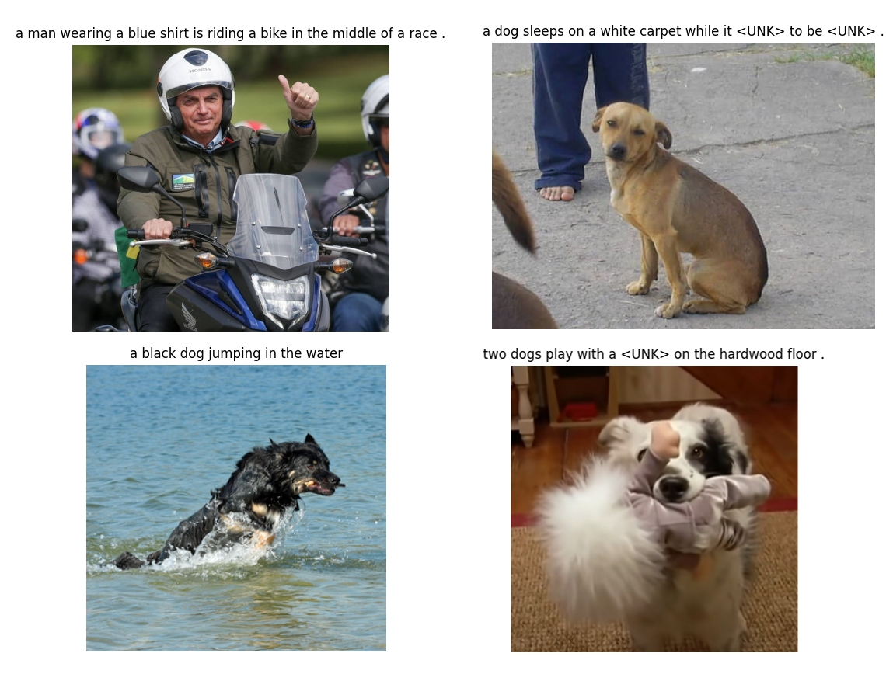

# image-to-text-transformer

This repository is an end-to-end transformer for image captioning. Its uses patch embedding for the visual information and a full transformer for the text encoding and decoding.


<div style="text-align: center;">
    
</div>


It's been a long time since I write something in pt-br which is my first language. This repo is written as a blog post too, so thats why it's it's not in english. The code is in english of course.

## Install

```sh
pip3 install -r requirements.txt
python3 -m spacy download en
```

---

## Introdução

Andrej Karpathy postulou já alguns anos que o Deep Learning poderia ser visto como o software 2.0, uma mudança de paradigma na maneira como é escrito mas que preserva várias das características do software que conhecemos. O Deep Learning não é propriamente escrito, mas uma série de módulos são colocados em sequência e realizam um processo matemático de otimização. Ou seja, criamos modelos compostos por várias camadas, como um arquiteto desenharia uma bela mansão dentro de uma montanha, com uma cachoeira que cai logo a sua frente e que é partida ao meio coincidentemente para que o dono possa vislumbrar o horizonte. Nós apenas criamos em nossa mente (ou desenhamos) modelos que imaginamos ter certa capacidade, mas cabe a um outro processo trazer do ato à potência a utilidade real do modelo, este processo conhecemos hoje como descida de gradiente estocástica, mas alguns cientistas são ferrenhos em afirmar que a verdadeira capacidade de nossos modelos só será explorada quando não dependermos de algo tão simples e passarmos a algo mais sofisticado.

Não é a primeira vez que não somos nós a trazer ideias do ato a potência na civilização humana, não fazemos carros com as nossas próprias mãos, nem construímos prédios de 50 andares com elas. Mas talvez seja sim a primeira vez em que uma máquina é a única capaz de trazer o conceito do ato a potência. Poderiamos construir um único carro com as próprias mãos utilizando de vários homens, ou mesmo construiriamos o mais alto dos prédios como um dia fizeram os egípcios, mas é impossível que calculassemos com nossas próprias mãos os mais de 100 bilhões de valores arbitrários que compõe um único dos modernos modelos. 

Mas isto é tão assustador assim? Já não conseguiriamos sem as máquinas produzir os computadores que hoje possuímos, quando olhamos para o assunto como abstrações responsáveis por trazer de fato conceitos para a realidade, já há algum tempo estamos construíndo ferramentas que temos grande dificuldade de produzir, a ponto de criarmos máquinas que as produzem. Você sabia que existem só duas empresas que produzem máquinas que produzem os chips de 3 ou 7 nanometros? A ASML e a TSMC, caso nunca tenha ouvido falar nelas terá agora um novo entendimento entre a tensão de China e EUA/Taiwan. 

A Intêligencia Artificial como é chamada, e que sob certo ponto de vista não tem nada de inteligência, é só mais uma dessas ferramentas, e que certamente será responsável por ser a produtora de outras ferramentas as quais não poderiamos construir com nossas próprias mãos, assim como as máquinas já foram. Ao meu ver, como seres humanos, sempre fomos ótimos fabricantes de fábricas, então me parece natural o ponto em que estamos.

Os computadores podem aprender tarefas sem serem programados para tal. No passado escreveriamos algoritmos extremamente complexos para identificar se em uma imagem há um gato ou se há um cachorro, afinal, escrever tal software com as próprias mãos não é nada trivial, foram necessários milhares de anos de evolução para que o cérebro de várias espécies começassem a identificar objetos no mundo e tirar conclusões disso. 

Hoje, sabemos que a abordagem mais simples e correta que alguém com pouco conhecimento em Python e (em minha opinião) nenhum conhecimento em Deep Learning pode fazer em 1 dia útil é treinar uma rede convolucional (CNN), algo que já possui milhares de tutoriais na internet, e 99% deles funcionam! Para o novato, basta baixar uma conjunto de imagens e rodar 5 ou 6 células em um Jupyter Notebook, e no final dele, já será capaz de utilizar qualquer imagem de gato ou cachorro como entrada e ter uma resposta acurada do computador! Isto era completamente inimaginável antes de 2012 com o advento da AlexNet, e certamente ainda seria inimaginável sem a existência de frameworks tão fáceis de utilizar como o PyTorch e linguagens como o Python.

Já há um certo tempo venho me perguntando o que seria o "Hello world" atual para o universo do Deep Learning hoje em 2024. Quando comecei a estudar em 2020, os Transformers já eram algo super popular, mas nossos modelos ainda eram BERT e GPT2, estavamos longe de modelos como o ChatGPT e Llama, ou de ferramentas magnificas como os modelos de difusão que criam imagens a partir do texto (Dall-e, Stable Diffusion). 

O "Hello World" que fiz em 2020 era exatamente o que descrevi acima, um conjunto de imagens de cães e gatos, Python, Pytorch e um Jupyter notebook encontrado na internet (para muitos, o Google Colab, como eu trabalhava há cerca de 10 meses com Python já conhecia as ferramentas básicas como o Jupyter no vscode). Após simplesmente rodar as células e ver a mágica acontecer, meu único trabalho era ler o código e tentar entender o que era tudo aquilo. O que é `conv2d`? o que é este `optimizer.Adam`? As peças já estavam todas encaixadas, o meu único trabalho era justamente entender como tudo aquilo se conectava, era como se o quebra-cabeças estivesse montado mas eu não pudesse ver onde as peças se encaixavam. Sem saber onde e como as peças se encaixam não é possível montar um outro quebra-cabeças, e este que estava em minhas mãos foi montado por alguma outra pessoa.

Quando finalizei o "Hello World", meus próximos passos foram baixar outro conjuntos de imagens e sair da classificação binária para a classificação de N classes! E se você já fez este exercício, certamente conhece o sentimento que surge de ser o ser humano mais sábio deste planeta ao ver corretamente o nome da classe acima de diferentes imagens. 
Caso tenha curiosidade, tenho em meu github o exato experimento que realizei naquele ano: https://github.com/GabrielDornelles/ResNet-18-PyTorch-Transfer-Learning-Cats-and-Dogs-breed-classification

O mundo evoluiu muito. Os Transformers estão em todos os lugares e cada vez mais eles saem do mundo acadêmico e nichado que antes habitavam e passam a entrar na vida das pessoas que não possuem conhecimento algum sobre computação. Veja, há nutricionistas utilizando o ChatGPT! Ilustradores utilizando o Stable Diffusion e ferramentas semelhantes! De maneira até distópica, há até figuras importantes gerando fake news com vídeos falsos onde é díficil dizer se o visual é real ou gerado por um modelo de Deep Learning, e a voz... Ahh a voz, é difícil diferenciar da real em muitos casos, certamente a essa altura você já ouviu as mais diferentes figuras (que não possuem nenhuma habilidade de canto) cantarem as mais diferentes músicas, trazendo aos seus ouvidos um sentimento estranho porém magnifico que é ouvir exatamente como você imaginou que fosse, mas apenas em sua imaginação jamais poderia conceber como de fato o som é.

Tanto a parte textual quanto visual estão em alta hoje, e felizmente elas podem ser compostas pelos mesmos módulos, o Transformer, algo que não era possível há poucos anos atrás, onde texto, visão e áudio eram áreas completamente distintas. Deixarei de fora neste momento o áudio, quem sabe ele não estará incluido no "Hello World" de daqui alguns anos?

Meu objetivo é trazer um "Hello World" que incorpora o básico dos Transformers em uma tarefa que envolva imagens e texto, e para isso escolhi a tarefa de *image-captioning*, que consiste em descrever o que está acontecendo em uma imagem. Com estes conhecimentos, é possível começar os estudos em modelos específicos de texto, ou modelos específicos de imagem, e também ter um vislumbre de como essas coisas se encaixam.

Parando pra pensar, que desperdicio é escrever sobre esse assunto! Afinal daqui dois anos é muito provável que o "Hello World" já seja outro... 

Mas de qualquer maneira, é com a convicção de que talvez este documento possa ser útil a alguém que estou escrevendo. E no pior dos casos, vai ser um fruto que irá me gerar nostalgia em algum futuro próximo.

## Objetivo

O objetivo técnico a resolvermos é o seguinte:

1. Um modelo capaz de descrever com texto o que está acontecendo em imagens
2. O modelo deve ser feito com módulos e blocos da arquitetura Transformers
3. Não deve possuir redes como LSTM, GRUs ou mesmo Redes convolucionais inteiras

Lembre-se que algumas destas restrições só foram colocadas para nos forçarmos a aprender algumas coisas novas, e que há modelos que utilizam de qualquer uma das 3 redes as quais não iremos utilizar.

## Table of Contents

1. Dataset
2. Tokenization
3. PatchEmbedding
4. Transformer
5. ?


## Patch Embedding

Para aqueles que já são familiares com a operação de convolução, não há nada de novo neste módulo, mas há sim algo novo na sua utilização.


```py
class PatchEmbedding(nn.Module):
    def __init__(self, img_size, patch_size, in_chans, embed_dim):
        super().__init__()
        self.img_size = img_size
        self.patch_size = patch_size
        self.n_patches = (img_size // patch_size) ** 2
        self.patch_size = patch_size
        self.proj = nn.Conv2d(in_chans, embed_dim, kernel_size=patch_size, stride=patch_size)

    def forward(self, x):
        # B: Batch   E: Embedding    P: Patch Size    N: Number of patches (P*P)
        x = self.proj(x)  # (B, E, P, P)
        x = x.flatten(2)  # (B, E, N)
        x = x.transpose(1, 2)  # (B, N, E)
        return x
```

O PatchEmbedding é o nosso módulo responsável por tornar a imagem um tensor semelhante ao texto que é passado aos transformers.

A ideia é que a imagem de entrada seja dividida em pequenos pedaços (chamados de patches), e esses patches sejam tratados como palavras em uma sequência de texto. Cada patch representa uma região da imagem e é tratado como uma unidade de entrada para o modelo. Isso permite que a modelo processe imagens de forma semelhante à forma como processa sequências de texto.

Este módulo é introduzido no artigo [An Image is Worth 16x16 Words](https://arxiv.org/abs/2010.11929), perdoe-me se eu estiver errado, pois pode neste ter sido popularizado e não introduzido.

> The standard Transformer receives as input a 1D
sequence of token embeddings. To handle 2D images, we reshape the image x ∈ R
H×W×C into a
sequence of flattened 2D patches xp ∈ R
N×(P²
·C)
, where (H, W) is the resolution of the original
image, C is the number of channels, (P, P) is the resolution of each image patch, and N = HW/P2
is the resulting number of patches, which also serves as the effective input sequence length for the
Transformer. 


O módulo PatchEmbeddings vem juntamente de PositionalEmbeddings, que é um parâmetro treinavel que introduz a ideia de ordem nas posições dos patches que foram "amassados" até virarem tokens que podem ser usados análogamente aos tokens de texto. No modelo, o código se parecerá como abaixo:

```py
self.patch_embed = PatchEmbedding(img_size, patch_size, in_chans, embed_dim)
self.pos_embed = nn.Parameter(torch.zeros(1, self.patch_embed.n_patches, embed_dim))
```

Não tenho certeza do motivo de inicializar o positional embeddings com zeros, mas encontrei múltiplas referências ao modelo ViT original enquanto fazia a minha pesquisa, e de fato, em [implementações antigas do huggingface](https://github.com/huggingface/pytorch-image-models/blob/v0.5.4/timm/models/vision_transformer.py#L281C9-L281C96) era feito desta forma.

Veja:

Nos dias de hoje parece mais adequado inicializar com a distribuição normal (`torch.randn`), como pode ver nas [implementações atuais do ViT](https://github.com/huggingface/pytorch-image-models/blob/v0.9.12/timm/models/vision_transformer.py#L493C9-L493C82)

Feito isso, já fizemos a parte de imagem do nosso modelo. Simples assim! Apenas uma convolução com kernel_size e strides altos e operações pra alteração do shape do tensor (flatten e transpose) que serão somados a um tensor de mesmo shape que chamamos positional embeddings.
